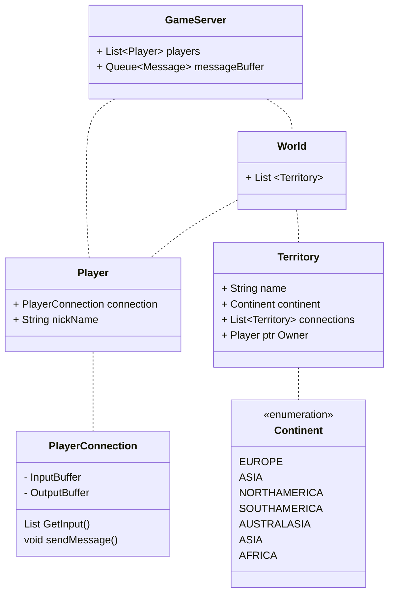
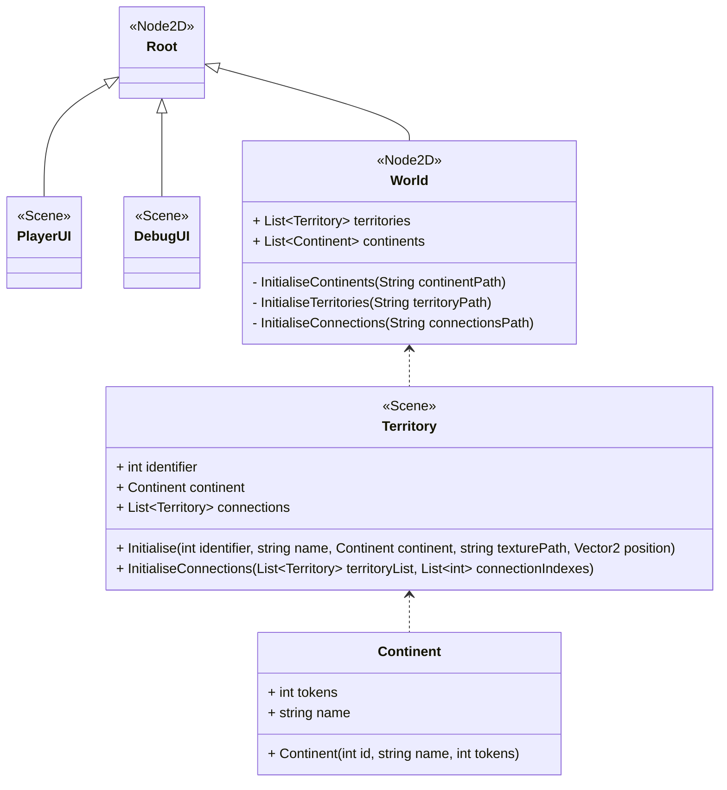

# Design Document for Sprint #1
This document is intended to provide an overview of the diagrams and other resources used to plan the **first sprint** for the software engineering project. It includes details regarding the design prior to the sprint's actual start.

## Initial Design

Initially, it was intended that the project would take on a **server-client design** whereby the server would handle all game-logic, and the client would act as a simple *input-output* system which presented data from the server in a visually-appealing manner and allowed users to input their moves. At most, it would have implemented basic validation for player move inputs. Any development on the client would have to have been preceeded by a period of time spent designing a *communication protocol* to dictate how the clients and server communicated amongst eachother.

### **Class Diagram for the server.**

Ultimately due to concerns regarding excessive complexity of implementing such a design, it was decided to abandon the server-client model in favour of having a singular offline client, whereby the game-logic was handled locally. 

# The New Design
The new design for the local single-client model is based around the node-centric structure of the Godot engine within which the game is to be implemented. At this stage in the development, players have not been implemented. 

## Requirements for the first sprint
- Design and implement data structures for the world map
- Get a basic way of displaying the data structures (e.g. simply display them as interconnected *nodes*).
- Load territory data from a file (e.g. a XML file)
- Set up a basic developer console system to allow methods to be called directly.
- Get a basic UI set up.

## Main Scene Diagram
