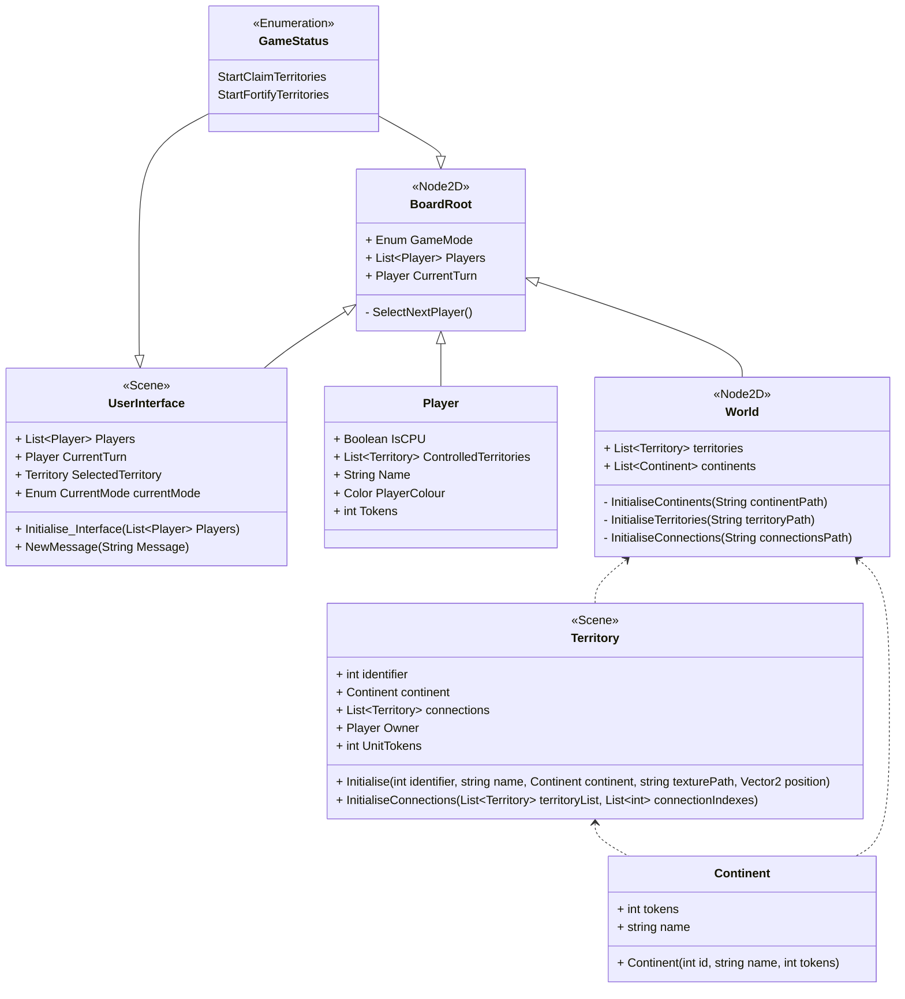
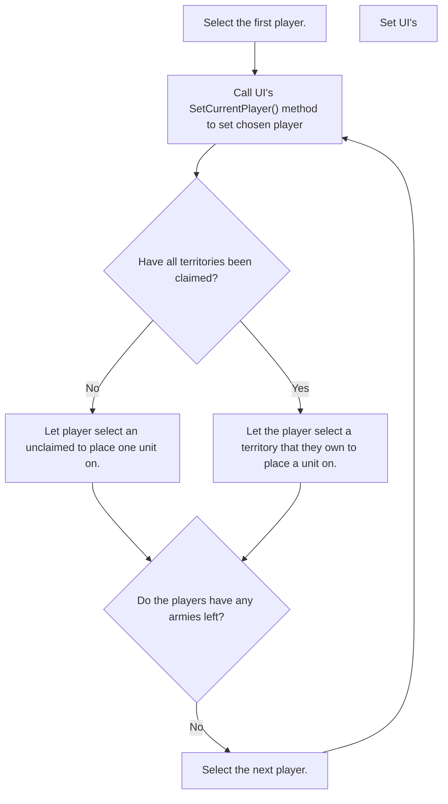

# Design Document for Sprint 2

This document is intended to give an outline for the design of the World Conquest board-game in it's second sprint.

## Sprint goals
* The game should start by showing a main menu, allowing the players to input settings such as what mode they want to play (e.g. normal World Conquest or Capital World Conquest), how many players want to play, and how many AI agents to include.
* Once ingame, the players should be able to choose their territories.
* There should be an interface which shows whose turn it is, and describes what actions have just been carried out.
* Allow players to select territories, adding user interface elements on high-light such as owning player, connections, units, etc.
* Implement the beginnings of the Player class

## Class Diagram for Main Game Scene

## Class Diagram for Main Menu

## Flow Chart for Territory Allocation

## Process for Selecting a Territory
1. When a territory is moused over, it is brightened slightly. This is handled node-side by the Territory.
2. When a Territory is then clicked, it darkens itself and a signal is sent.
3. This signal is handled by the UserInterface.
4. The UserInterface displays the currently selected territory.

## Process for first stage (Claiming Territories)
1. Board selects the first player
2. Board sets the UserInterface scene's `CurrentTurn` to the first player, and `CurrentMode` to `StartClaimTerritories`
3. UserInterface waits for the player to click a territory.
4. UserInterface displays territory details, with button allowing player to claim the territory.
5. If the player clicks the button, the UserInterface sends a signal with the Territory claimed.
6. The Board handles the signal and assigns the territory to the player.
7. Select next player with tokens left

## List of Signals
* **Territory**
    * `TerritoryClicked(Territory territory)`: Indicates that a Territory has been clicked on the board. This signal is intended to be handled by the BoardRoot. Once this signal is recieved by the BoardRoot, the BoardRoot will change the UserInterface attribute `CurrentTerritory`. A setter method will then set the current 
* **UserInterface**
    * Start Stage (i.e. when everyone is still claiming their territories)
        * `StartPlayerClaimedTerritory(Territory territory)`: Indicates that the currently selected territory (as set by the BoardRoot instance) has been confirmed in the menu.
        * `StartPlayerFortifiedTerritory(Territory territory, int tokens)`: Indicates that the player has confirmed a territory to place a token on.
* **World**
    * Initialisation
        * `InitialisedTerritories(List<Territory> territories)`: Indicates that the continents, territories and connections have been initialised, and sends a reference to the Territory list to the root so that the root can listen for territory clicked and change the UserInterface method.

## Miscellaneous Design Notes
* This software will follow the principle of __**call down, signal up**__. That is so as to say, if a child node wants to interact with a parent node, it should communicate via Godot signals. If a parent node wants to interact with a child node, it should communicate via a direct method call to that child.

## Design Notes & Issues
* Originally the `TerritoryClicked(Territory territory)` signal was to be handled directly by the User Interface. This was not possible, because it would have required finding each territory within the UserInterface class, and connecting each individual signal, which would have been problematic. Instead, the `TerritoryClicked(Territory territory)` signal will be handled by the BoardRoot, which will then set the `CurrentTerritory` attribute of the UserInterface. A setter method will be set up to update the Territory Data menu and change it's position relative to the mouse.