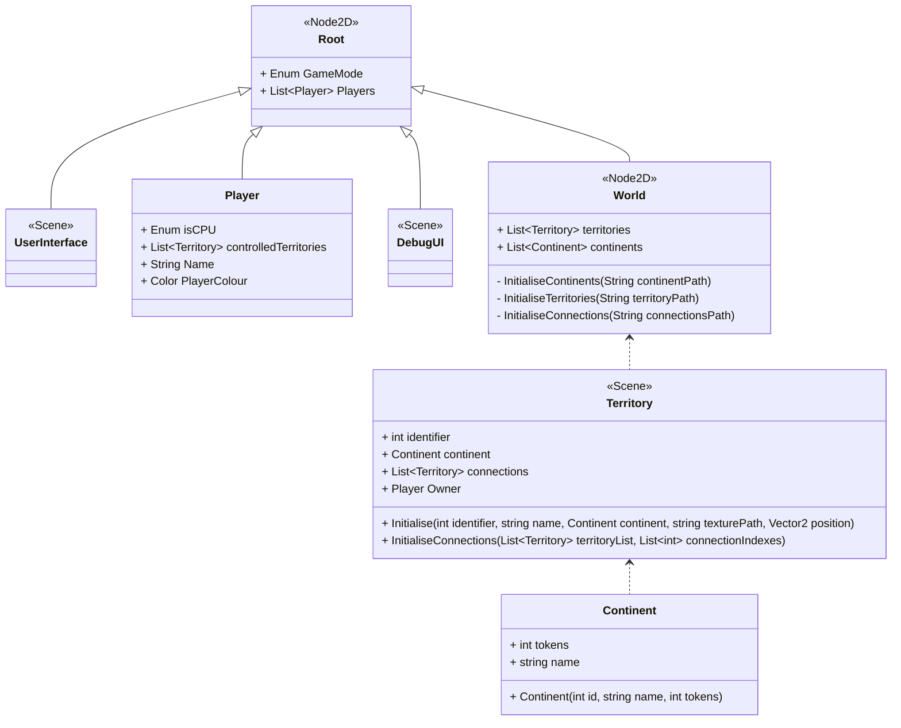
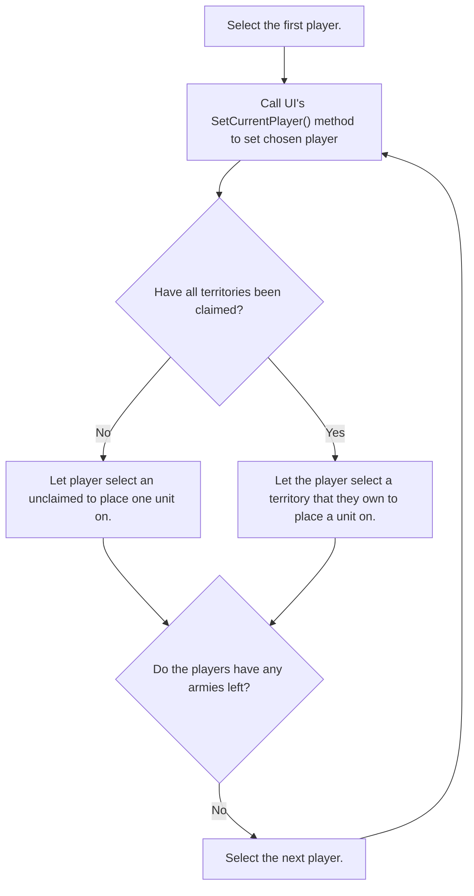

# Design Document for Sprint 2

This document is intended to give an outline for the design of the World Conquest board-game in it's second sprint.

## Sprint goals
* The game should start by showing a main menu, allowing the players to input settings such as what mode they want to play (e.g. normal World Conquest or Capital World Conquest), how many players want to play, and how many AI agents to include.
* Once ingame, the players should be able to choose their territories.
* There should be an interface which shows whose turn it is, and describes what actions have just been carried out.
* Allow players to select territories, adding user interface elements on high-light such as owning player, connections, units, etc.
* Implement the beginnings of the Player class

## Class Diagram for Main Game Scene


## Class Diagram for User Interface
```
```

## Class Diagram for Main Menu

## Flow Chart for Territory Allocation


## Process for Selecting a Territory
1. When a territory is moused over, it is brightened slightly. This is handled node-side by the Territory.
2. When a Territory is then clicked, it darkens itself and a signal is sent.
3. This signal is handled by the UserInterface.

## Miscellaneous Design Notes
* This software will follow the principle of __**call down, signal up**__. That is so as to say, if a child node wants to interact with a parent node, it should communicate via Godot signals. If a parent node wants to interact with a child node, it should communicate via a direct method call to that child.

