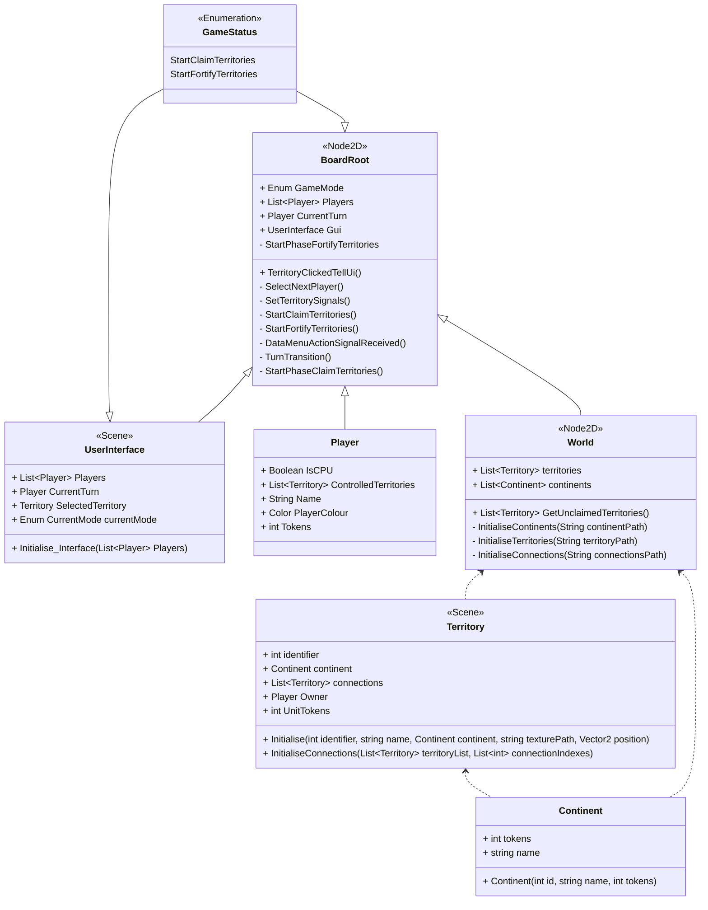
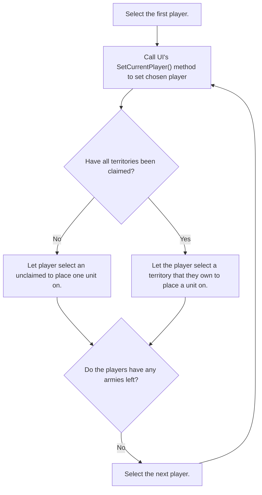
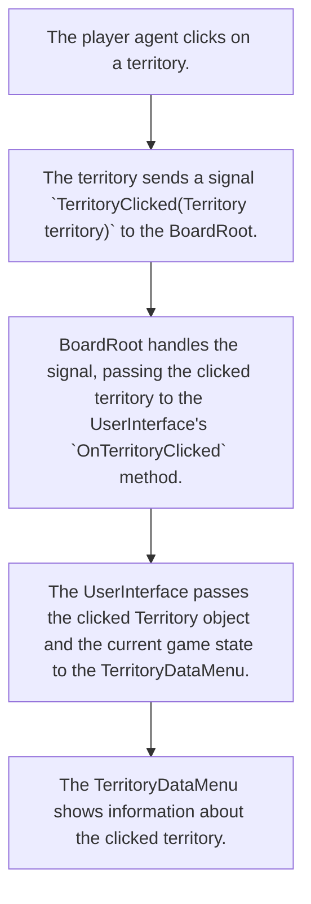
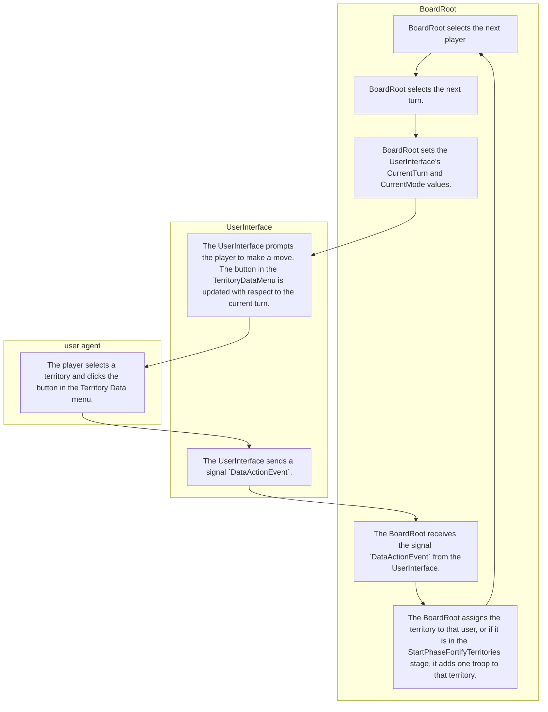

# Design Document for Sprint 2

This document is intended to give an outline for the design of the World Conquest board-game in it's second sprint.

## Sprint goals
* The game should start by showing a main menu, allowing the players to input settings such as what mode they want to play (e.g. normal World Conquest or Capital World Conquest), how many players want to play, and how many AI agents to include.
* Once ingame, the players should be able to choose their territories.
* There should be an interface which shows whose turn it is, and describes what actions have just been carried out.
* Allow players to select territories, adding user interface elements on high-light such as owning player, connections, units, etc.
* Implement the beginnings of the Player class

## Class Diagram for Main Game Scene


## Game logic pseudocode:
```
Ready:
	Set current GameState to StartClaimTerritoriesStage
	Set the the first player using SetCurrentPlayer()
	Update the GUI to reflect the current player and stage.

DataMenuActionSignalReceived: (Called when the button in the DataMenu is clicked.)
	If in StartClaimTerritories phase:
		StartPhaseClaimTerritories()
	If in StartFortifyTerritories phase:
		StartPhaseFortifyTerritories()
		

TurnTransition:
	If in StartClaimTerritories Phase:
		If there are any unclaimed territories left (i.e. if World.GetUnclaimedTerritories() returns a non-empty list):
			Select a new player to claim a territory using SetCurrentPlayer()
		Else:
			Set phase to StartFortifyTerritories
			TurnTransition()
	if in StartFortifyTerritories:
		If all territories are claimed:
			If there is at least one player with remaining tokens:
				While the currently selected player has no tokens:
					Select the next player to fortify a territory using SetCurrentPlayer()
			If none of the players have any tokens left:
				End the StartFortifyTerritories phase.
				Set player index pointer to -1
				TurnTransition()
			
StartPhaseClaimTerritories:
	Get the currently selected territory from the GUI.
	Assign the claimed territory to the player.
	Add the territory to the player's internal list of territories.
	TurnTransition()
	

StartPhaseFortifyTerritories:
	Get the currently selected territory from the GUI.
	Assign said territory one extra infantry token.
	Take one infantry token from the player.
	TurnTransition()


List<Territory> World.GetUnclaimedTerritories:
	Return a list of territories that have no owner.
```

## Flow Chart for Territory Allocation


## Process for Selecting a Territory


## Process for player interaction in the Claim Stage.


## List of Signals
* **Territory**
    * `TerritoryClicked(Territory territory)`: Indicates that a Territory has been clicked on the board. This signal is intended to be handled by the BoardRoot. Once this signal is recieved by the BoardRoot, the BoardRoot will change the UserInterface attribute `CurrentTerritory`. A setter method will then set the current 
* **UserInterface**
    * `DataMenuAction(Territory territory)`: Indicates that a territory has been selected in the TerritoryDataMenu.

## Miscellaneous Design Notes
* This software will follow the principle of __**call down, signal up**__. That is so as to say, if a child node wants to interact with a parent node, it should communicate via Godot signals. If a parent node wants to interact with a child node, it should communicate via a direct method call to that child.

## Design Notes & Issues
* Originally the `TerritoryClicked(Territory territory)` signal was to be handled directly by the User Interface. This was not possible, because it would have required finding each territory within the UserInterface class, and connecting each individual signal, which would have been problematic. Instead, the `TerritoryClicked(Territory territory)` signal will be handled by the BoardRoot, which will then set the `CurrentTerritory` attribute of the UserInterface. A setter method will be set up to update the Territory Data menu and change it's position relative to the mouse.
* There is a bug where hovering territories seems to make them invisible.
* Originally a signal called `InitialisedTerritories(List<Territory> territories)` was to be emitted once the continents, territories and connections were all initialised. This signal was redundant as Godot initialises children first before their parent nodes. 
* There were originally going to be two signals sent by the UserInterface called `StartPlayerClaimedTerritory(Territory territory)` and `StartPlayerFortifiedTerritory(Territory territory, int tokens)`. They were scapped in favour of the signal `DataMenuActionEventHandler`.