# Design Document for Sprint 2

This document is intended to give an outline for the design of the World Conquest board-game in it's second sprint.

## Sprint goals
* The game should start by showing a main menu, allowing the players to input settings such as what mode they want to play (e.g. normal World Conquest or Capital World Conquest), how many players want to play, and how many AI agents to include.
* Once ingame, the players should be able to choose their territories.
* There should be an interface which shows whose turn it is, and describes what actions have just been carried out.
* Allow players to select territories, adding user interface elements on high-light such as owning player, connections, units, etc.
* Implement the beginnings of the Player class.

## Class Diagram for Main Game Scene

```mermaid
classDiagram
    class Root {
        <<Node2D>>
        + Enum GameMode
        + List~Player~ Players
        + Player CurrentPlayer
        - SelectNextPlayer()
        + StartClaimTerritoryEventHandler(Territory territory)
        + StartFortifyTerritoryEventHandler(Territory territory)
    }

    class UserInterface {
        <<Scene>>
    }

    class Player {
        + Enum isCPU
        + List~Territory~ controlledTerritories
        + String Name
        + Color PlayerColour
    }

    class DebugUI {
        <<Scene>>
    }

    class World {
        <<Node2D>>
        + List~Territory~ territories
        + List~Continent~ continents
        - InitialiseContinents(String continentPath)
        - InitialiseTerritories(String territoryPath)
        - InitialiseConnections(String connectionsPath)
    }


    class Territory {
        <<Scene>>
        + int identifier
        + Continent continent
        + List~Territory~ connections
        + Player Owner
        + int UnitTokens
        + Initialise(int identifier, string name, Continent continent, string texturePath, Vector2 position)
        + Initialise_Connections(List~Territory~ territoryList, List~int~ connectionIndexes)
        - Initialise_Collisions()
    }

    class Continent {
        + int tokens
        + string name
        + Continent(int id, string name, int tokens)
    }

    Root <|-- UserInterface
    Root <|-- DebugUI
    Root <|-- Player
    Root <|-- World
    World <.. Territory
    Territory <.. Continent
```

## User Interface Design
### User Interface Class Diagram

### Process for Selecting a Territory
1. When a territory is moused over, it is brightened slightly. This is handled node-side by the Territory.
2. When a Territory is then clicked, it darkens itself and a signal is sent.
3. This signal is handled by the UserInterface.
4. The UserInterface displays details about the currently selected Territory, including it's name, owner, how many troops are placed on that territory, continent and connections.

## Main Menu Design

### 

## Game Logic Design

### Flow Chart for Territory Allocation

### Process for first stage (Claiming Territories)
1. Board selects a player, starting from the first player, and selecting the next player who still has tokens left after each turn. 
2. Board sets the UserInterface scene's CurrentTurn, and sets the UserInterface scene's CurrentMode to either `START_CLAIM_TERRITORIES` if there are still territories left to claim, or `START_FORTIFY_TERRITORIES` if there are no territories left to claim but players still have tokens to place.
3. If the player is not an AI, the UI should display which player is currently active, and prompt the player to either select an unclaimed territory or select one of their current territories. If the player is an AI, the UI should temporarily grey out options and allow the Board to take action.
4. Once the player has clicked on a territory, the UI should display a menu prompting the player to carry out an action on that territory. The action specified by this menu will vary based on what `CurrentMode` value is currently set.
5.

## Miscellaneous Design Notes
* This software will follow the principle of __**call down, signal up**__. That is so as to say, if a child node wants to interact with a parent node, it should communicate via Godot signals. If a parent node wants to interact with a child node, it should communicate via a direct method call to that child.

