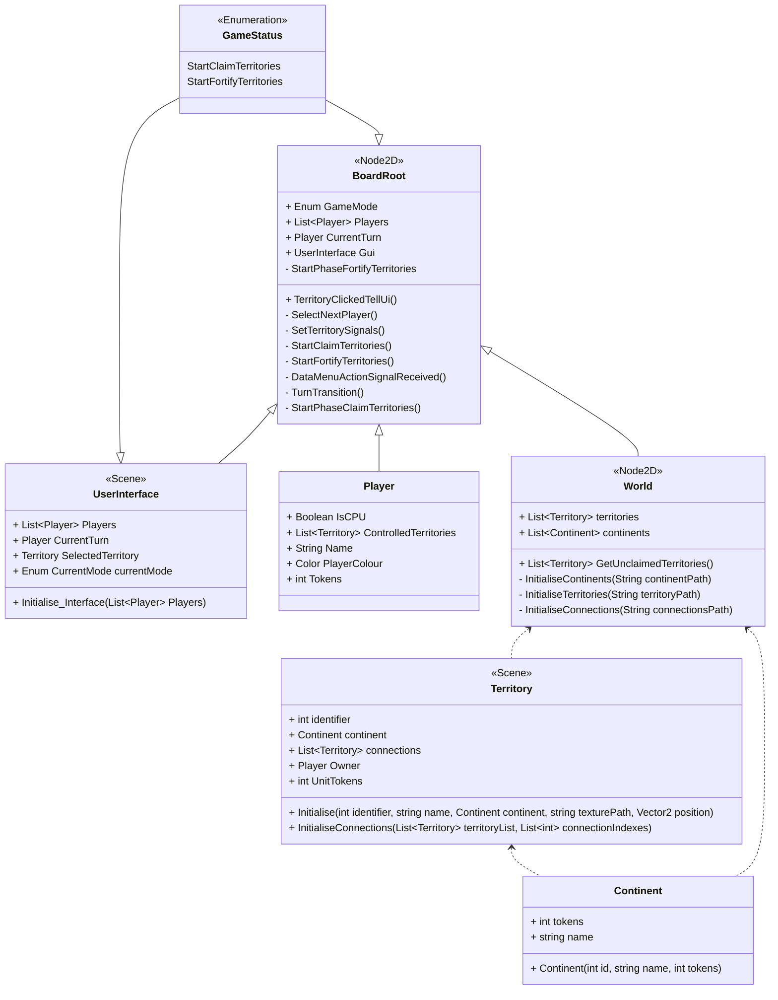
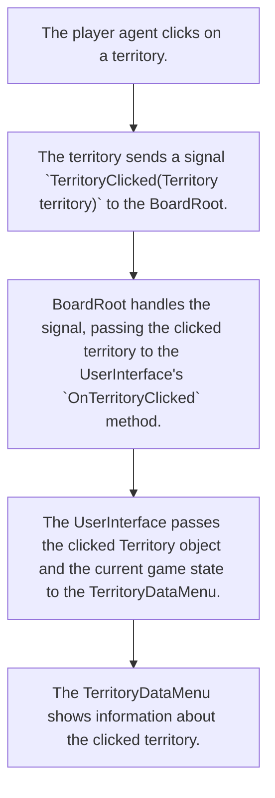
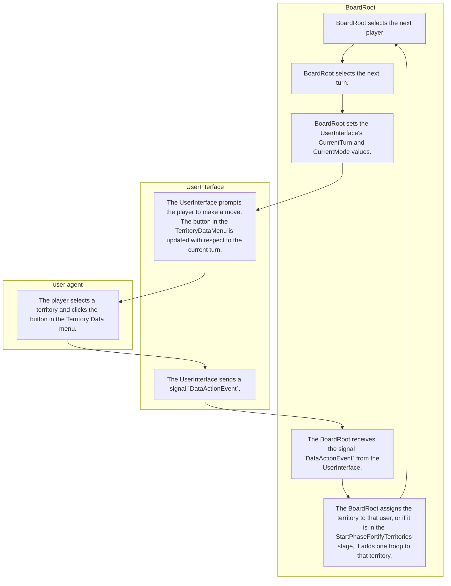
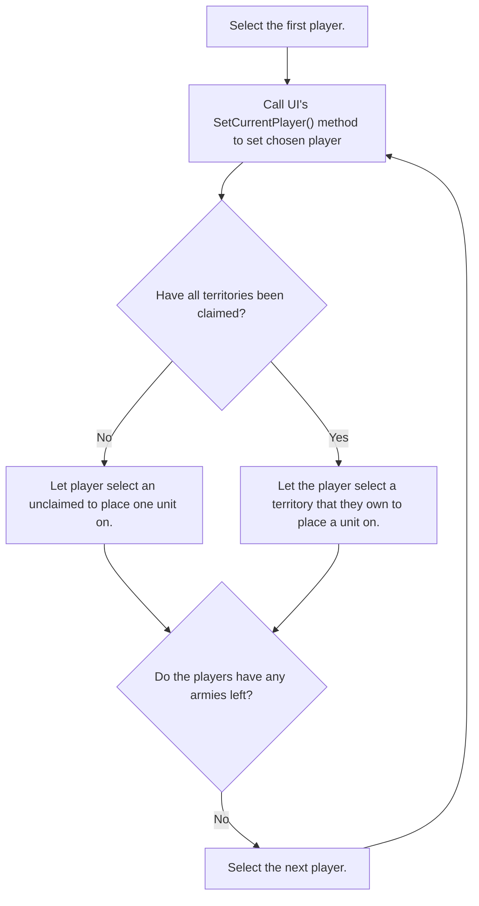

# Design Document for Sprint 3
This document is intended to describe the design for the third Sprint of the development process for the World Conquest video-game. The goal of this sprint include:
* Implementing the first stage of a player's turn, during which they can place troops.
* Implementing a system that gives players troop bonuses depending on if they control any continents.
* Add a GUI element to show how many troops are on each territory without having to click on said territory.
* Polishing some of the previously implemented features:
    * Fixing a bug that seems to cause territory interconnections to be loaded incorrectly.
    * Loading the game background from file by the World class' initialisation function rather than being defined in Godot itself.
    * Updating the ingame background image to show connections over sea.
* Completing a few tasks which were originally slated to be carried out in the second sprint, but were carried forwards.
    * Merging the development of the Main Menu and using it to initialise and launch a game.
    * Designing and implementing a system for controlling AI players.
    * Adding support to the UI to deal with AI player turns.
* Removing inconsistencies between the design document and the actual code itself (e.g. misnamed variables)

## Class Diagram for Main Game Scene


## List of Signals
* **Territory**
    * `TerritoryClicked(Territory territory)`: Indicates that a Territory has been clicked on the board. This signal is intended to be handled by the BoardRoot. Once this signal is recieved by the BoardRoot, the BoardRoot will change the UserInterface attribute `CurrentTerritory`. A setter method will then set the current 
* **UserInterface**
    * `DataMenuAction(Territory territory)`: Indicates that a territory has been selected in the TerritoryDataMenu.
    * `SpinBoxInputConfirmed(int numInput)`: Sent by UserInterfaceNumberInput. `numInput` is the number that the user inputted into the box. 

## Game logic pseudocode:
The following pseudocode describes some of the functions within the `BoardRoot` class which are used to transition between different turn stages and different players. 
```
Ready:
	Set current GameState to StartClaimTerritoriesStage
	Set the the first player using SetCurrentPlayer()
	Update the GUI to reflect the current player and stage.

DataMenuActionSignalReceived: (Called when the button in the DataMenu is clicked.)
	If in StartClaimTerritories phase:
		StartPhaseClaimTerritories()
	If in StartFortifyTerritories phase:
		StartPhaseFortifyTerritories()

EndTurnStageButton: (Called when the end turn stage button is clicked)
    if in TurnPlacementStage:


TurnTransition:
	If in StartClaimTerritories Phase:
		If there are any unclaimed territories left (i.e. if World.GetUnclaimedTerritories() returns a non-empty list):
			Select a new player to claim a territory using SetCurrentPlayer()
		Else:
			Set phase to StartFortifyTerritories
			TurnTransition()
	if in StartFortifyTerritories:
		If all territories are claimed:
			If there is at least one player with remaining tokens:
				While the currently selected player has no tokens:
					Select the next player to fortify a territory using SetCurrentPlayer()
			If none of the players have any tokens left:
				Set phase to TurnPlacementStage.
				Set player index pointer to -1
				TurnTransition()
    If in TurnPlacementStage:
        /* Note: This turn will only end once the player clicks "EndStage", so unlike the previous two stages, the logic for transitioning to the next stage will be handled by the event handler for when the EndTurn button is pressed.*/
        Select the next player using SetCurrentPlayer()
        Tally up how many extra troops the player gets that turn:
            3 + continent bonuses for any continents returned by World.PlayerOwnsTerritories(Player p)
        Add the total extra troops for this turn to the player's Tokens.
        Update the UI to reflect the current turn stage and active player.

			
StartPhaseClaimTerritories:
	Get the currently selected territory from the GUI.
	Assign the claimed territory to the player.
	Add the territory to the player's internal list of territories.
	TurnTransition()
	

StartPhaseFortifyTerritories:
	Get the currently selected territory from the GUI.
	Assign said territory one extra infantry token.
	Take one infantry token from the player.
	TurnTransition()


List<Territory> World.GetUnclaimedTerritories:
	Return a list of territories that have no owner.

List<Continent> World.PlayerOwnsTerritories(Player p):
    Returns a list of continents in which the player specified owns all territories.
```

# Designs from Previous Sprints
## Process for Selecting a Territory


## Process for player interaction in the Claim Stage.


## Flow Chart for Territory Allocation

